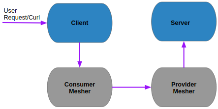

# PHP-Mesher-Example
   

 1) using dockercompose build the container image of php server and php client and start the the container along with mesher
  
     docker-compose up
 2) To verify the php client and php server communication
 
       curl request http://[ipaddress of the client]:8888/client.php
       ```
       curl http://127.0.0.1:8888/client.php

       OUTPUT:
       10
       ```

## Diagram




#
etcdctl member list

etcdctl cluster-health

curl http://etcd-2:2379//v2/members

curl http://etcd-1:2379/v2/stats/leader

curl http://etcd-1:2379/v2/stats/self

curl http://etcd-1:2379/v2/stats/store

添加:
curl http://etcd-1:2379/v2/members -XPOST -H "Content-Type: application/json" -d '{"peerURLs": ["http://192.167.0.170:2480"]}'
test:
curl http://etcd-2:2379/v2/members
curl http://etcd-3:2379/v2/members      
